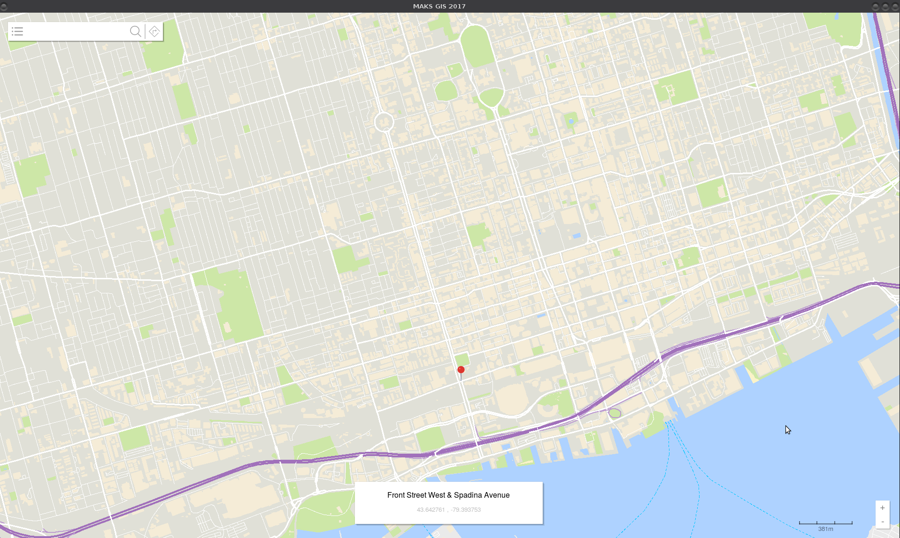
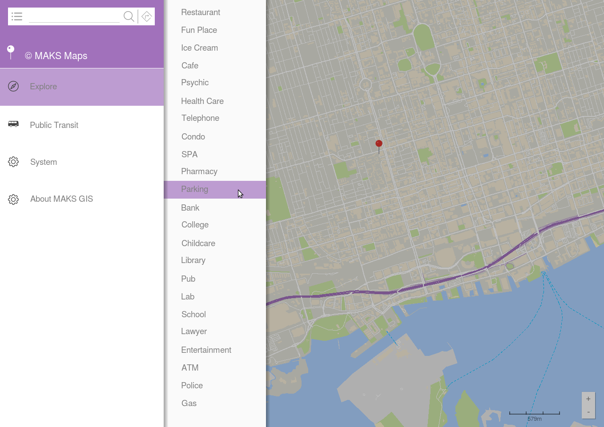
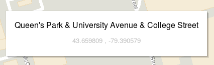
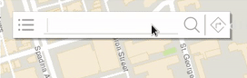
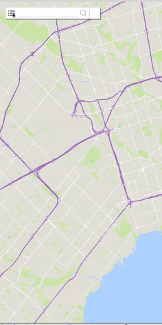
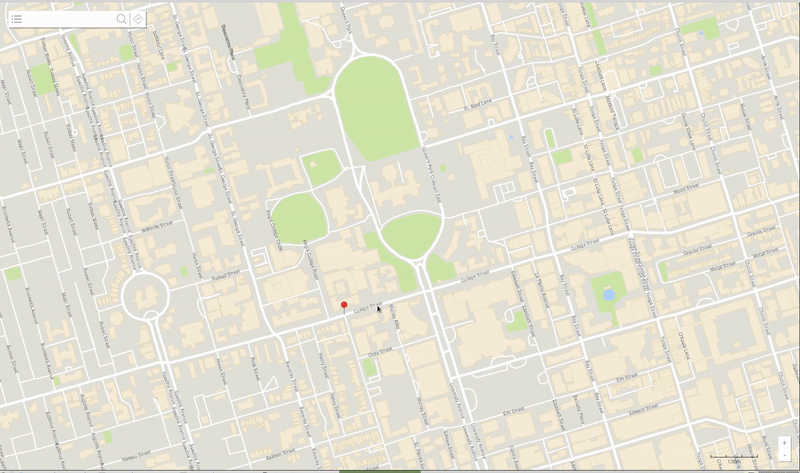
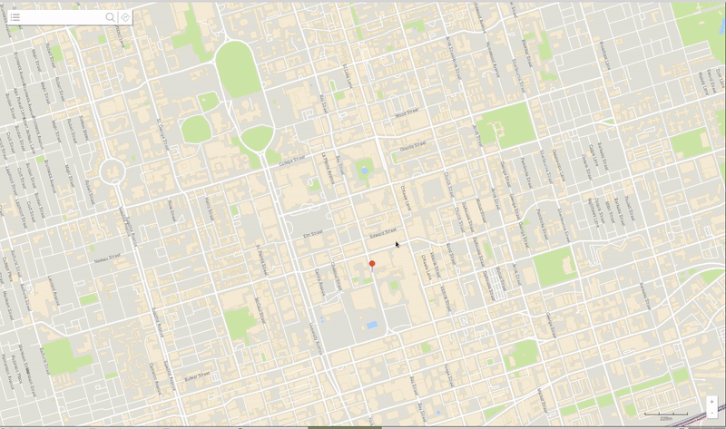

# High-Performance Google Maps Implementation Using OpenStreetMap Data

## MAKS Maps

This repository showcases a **clean-room implementation** of Google Maps, built in **high-performance C++**, leveraging **binary data from the OpenStreetMap (OSM) project**. Developed entirely independently, this project includes an intuitive and feature-rich UI along with advanced pathfinding and navigation algorithms. It was a comprehensive endeavor that achieved professional-grade GIS polish.

## Features

### Core Functionalities
- **Dynamic Map Rendering**: Smooth, zoomable, and interactive maps using OSM data.
- **Route Planning**: Optimized routes for single and multi-destination trips.
- **Turn-by-Turn Navigation**: Real-time instructions based on precomputed paths.
- **Geocoding and Reverse Geocoding**: Conversion between human-readable addresses and geographic coordinates.
- **Search**: High-speed search functionality for locations, addresses, and points of interest.

### Advanced Capabilities
- **Traveling Salesperson Problem (TSP) Heuristics**: Efficient routing for multi-stop deliveries with custom heuristics.
- **Customizable UI**: Intuitive user interface inspired by modern mapping applications.
- **High-Performance Multithreading**: Parallelized algorithms to handle large-scale data efficiently.

## Technical Details

### Tools and Libraries
- **Programming Language**: C++ (highly optimized for performance).
- **Libraries Used**:
  - OpenStreetMap Data API
  - Nanoflann for geospatial data manipulation
  - Qt for the UI framework
  - Boost for advanced C++ features

### Algorithm Highlights
- **Pathfinding**:
  - Dijkstra's and A* algorithms for shortest path computation.
  - Custom heuristics for faster convergence in urban environments.
- **Map Rendering**:
  - Quad-tree indexing for real-time map rendering.
  - Binary data preprocessing for OSM data.
- **Optimization**:
  - Custom memory management to handle large datasets.
  - Nanoflann optimizations for computational geometry tasks.

### Unique Challenges and Solutions
- Handling **massive datasets** efficiently by preprocessing and storing data in binary formats.
- Designing a **scalable architecture** to accommodate real-time updates and future feature expansion.
- Overcoming computational limitations of the TSP by implementing effective heuristics.

## Showcase

_A fully interactive and feature-complete user interface._

_Sidemenu showing POI interface, public transit options, settings and the tasteful name of the product_

_Maximum level zoom POI information_

_Full high precision coordinate system support_

_Autocomplete support, modern UI, shadows, animations_

_Sidemenu showing POI interface, public transit options, settings as an animation_

_Dynamic route computation with seamless updates - demonstrated between arbitrary pin-chosen locations. A* algorithm visualization enabled for demo purposes._

_Real-time animation of zoom levels_

_Slowed demonstration of close zoom_

_Slowed demonstration of POI maximum level zoom_

## How to Build and Run

This project builds a Linux executable named `mapper` using a provided `Makefile`.

### Prerequisites

-   GCC 9.0+ or MSVC 2019+
-   CMake 3.15+
-   Make
-   Qt 5.15+
-   Boost Libraries
-   OSM data in binary format (you must provide this separately due to licensing).

### Build Instructions

1.  **Clone:** `git clone <your-repo-url>` and `cd` into the directory.
2.  **Build:** Run `make` in the project root (where the `Makefile` is).
3.  **Run:** Execute `./mapper`, ensuring your OSM binary data is in the correct location.

**Note:** You may need to adjust library paths if you encounter build errors. If the application has issues loading, ensure your OSM data is correctly formatted. Refer to the full README for more detailed instructions.

## Future Potential Work
- Integration with real-time traffic APIs.
- Mobile application support for iOS and Android.
- Advanced predictive algorithms for user behavior.

## Author
Developed by [Max](https://github.com/maxsteep) and Kevin Xu, leveraging a passion for geospatial technology and high-performance computing.

---

This project represents signficant effort and a commitment to quality, aiming to push the boundaries of what's possible with open-source data and high-performance computing.
